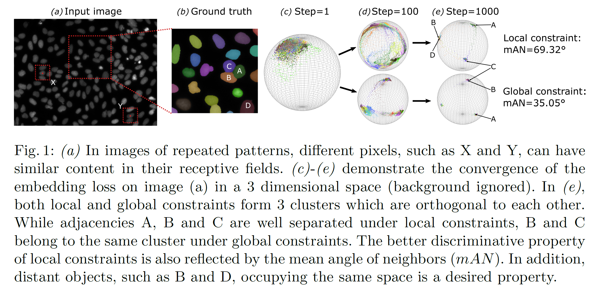
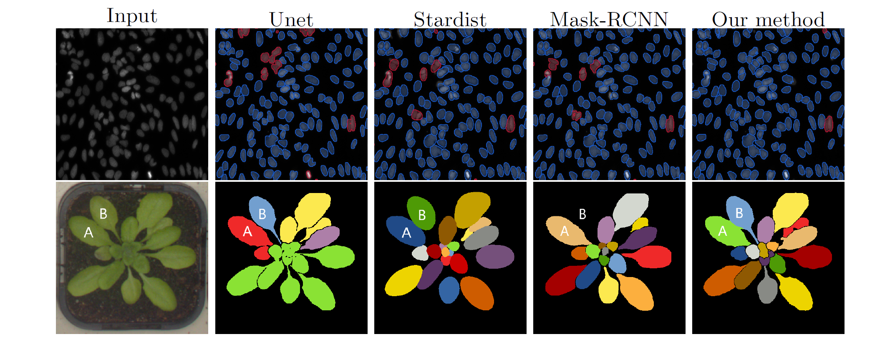

# Instance Segmentation with Pixel Embeddings

[Institute of Imaging & Computer Vision, RWTH Aachen University](https://www.lfb.rwth-aachen.de/en/)  

This repository (InstSegv1) contains the implementation of instance segmentation approach described in the papers:

- Long Chen, Martin Strauch and Dorit Merhof.  
Instance Segmentation of Biomedical Images with an Object-Aware Embedding Learned with Local Constraints \[[Paper](https://www.researchgate.net/publication/336396370_Instance_Segmentation_of_Biomedical_Images_with_an_Object-Aware_Embedding_Learned_with_Local_Constraints)\]  
International Conference on Medical Image Computing and Computer-Assisted Intervention (MICCAI) 2019.

Please [cite the paper(s)](#how-to-cite) if you are using this code in your research.

Check [instSeg](https://github.com/looooongChen/instSeg) for reconstructed code (tensorflow 2.x) and improved work.

## Overview:

<p align="center">

<p>

To decouple the embedding branch and the distance regression branch, we construct a decode path for each. Compared to the sturcture in the paper (two branches on the same feature map), the training is of decoupled path is more robust.  

<p align="center">

<p>

# Prerequisites 

## Python dependencies:

- tensorflow (programmed with tf 1.14)
- scikit-image
- opencv

## Data dependencies:

In the paper, we tested the network with two datasets:
- BBBC006: a hunman U2OS cell dataset [bbbc006](https://data.broadinstitute.org/bbbc/BBBC006/)
- CVPPP: leaf segmentation dataset [cvppp2017](https://competitions.codalab.org/competitions/18405#learn_the_details) 


# Usage

## convert your dataset to tfrecords

You can use the function ```def create_tf_record()``` in ```utils/tfrecords_convert.py``` to convert your dataset to tfrecords. Images will be resized to the same, distance map and neighbor relationship will be computed and saved in tfrecord files. 

The function requirs two python dictionary ```image_dict``` and ```gt_dict``` as inputs. Dictionary values are the path of input images and label images, respectively. Dictionary keys are only used to determine which label image corresponds to which input image, so any kind of identifier can be used as the key.

Other arguments:
- neighbor_distance_in_percent: [0, 1], the distance to determine neighborhood, in percentage of image width
- resize: to form a training batch, images should be resized to the same
- dist_map: boolen, compute distance map or not
- gt_type: 'label' for label map / 'indexed' for indexed png

Example scripts for converting tfrecords are provided:
- BBBC006 dataset: ```prepare_U2OScell_tfrecords.py```
- CVPPP2017 dataset: ```prepare_cvppp_tfrecords.py```

Note:
- label images are saved as uint16: objects in one image should not more than 2<sup>16</sup> - 1 = 65535 (0 is reserved for background) 
- the distance map is normalized per object and saved as uint8    

## train the model

To train your own model, run:
``` python train.py --phase=train ```

other options of ```main.py``` are provided to config the training, refer to ```main.py``` for details.

## prediction

``` python train.py --phase=test --test_dir=../.. --test_res=../..```

Images in ```test_dir``` will be read and segmented, with the segmentation mask saved under ```test_res```. Segmentations will be also saved as indexed png for visualization purpose. 

## evaluation
``` python train.py --phase=evaluation ```
Since the file structure varies from dataset to dataset, we only provide a ```Evaluator``` class, which can report precision and recall under different IoU/F-score. You can use it to implement your own evaluation easily. Refer to ```utils/evaluation.py``` for details. 

# Results

## Comparision with other methods
<p align="center">

<p>


## How to cite 
```

@inproceedings{LongMACCAIInstance,  
  author = {Long Chen, Martin Strauch, Dorit Merhof},  
  title = {Instance Segmentation of Biomedical Images with an Object-Aware Embedding Learned with Local Constraints},  
  booktitle = {MICCAI 2019},  
  year = {2019},  
}

```